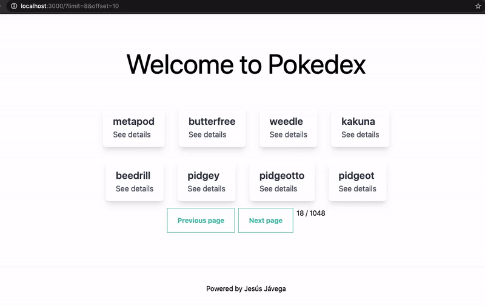

# NestJS struture



 * [Technologies used](#technologies-used)
   + [Prerequisites](#prerequisites-)
   + [Core](#core)
   + [Styles](#styles)
   + [Tests](#tests)
   + [Code quality](#code-quality)
   + [Other used libraries and their reason](#other-used-libraries-and-their-reason)
* [Project structure](#project-structure)
  * [Naming conventions](#naming-conventions)
  * [Scaffolding](#scaffolding)
  * [Work locally](#work-locally)
  * [Unit test](#unit-test)
  * [Test E2E](#test-e2e)
  * [Services](#services)
    + [Recomendations](#recomendations)
    + [API Documentation](#api-documentation)
  * [Router](#router)
  
  
# Technologies used
## Prerequisites:
To launch the application you need first install some mandatory dependencies.

At the time of writing this document we are using the following global versions:

| --          | Nodejs    | NPM        |
| --          | --         | --        |
| **Version** | **10.19.0** | **>=6.13.4** |


## Core
- [React](https://es.reactjs.org/) + [NextJS](https://nextjs.org/). √
- Data validator, [prop-types](https://www.npmjs.com/package/prop-types) √
- Fetch, with [Axios](https://github.com/axios/axios) and [react-query](https://github.com/tannerlinsley/react-query) √
- Extras:
    - [i18n](https://www.i18next.com/) X (not install yet)
    - [Forms: with react hook form](https://react-hook-form.com/) X (not install yet)
     
## Styles
- [Sass](https://sass-lang.com/), Without css-modules. √
- [Storybooks](https://storybook.js.org/), lib for ui-components.  X (not install yet)

## Tests
- Unit test:
    - [Unit test, with react testing library](https://github.com/testing-library/react-testing-library)  X (not install yet)
    - [jest-dom](https://github.com/testing-library/jest-dom) and [jest](https://jestjs.io/) √
- [E2E testing with Cypress.io](https://react-hook-form.com/) √

## Code quality
- [Eslint](https://eslint.org/) with [Wesbos config](https://github.com/wesbos/eslint-config-wesbos) and [Prettier](https://prettier.io/) √

## Other used libraries and their reason
- [axios-mock-adapter](https://www.npmjs.com/package/axios-mock-adapter) For init project mocks, Axios adapter that allows to easily mock requests.
- [tailwindcss](https://tailwindcss.com/docs) For css help.


# Project structure

## Naming conventions

- For folders containing services: kebab-case
- Filename: Use PascalCase for filenames. E.g., ReservationCard.jsx.
- Reference Naming: Use PascalCase for React components and camelCase for their instances.
- Component Naming: Use the filename as the component name.
- Variable and function names written as camelCase
- Global variables written in UPPERCASE (We don't, but it's quite common)
- Constants (like PI) written in UPPERCASE

Also check this, more synthesized [Naming conventions Airbnb react](https://github.com/airbnb/javascript/tree/master/react#naming) 

## Scaffolding
- components/: Logic components.
- config/
    - constants/: constants folder.
    - config.js : to transform the process.env and global configuration
    - routes.js : file where we will be able to find all the path/routes available on the web, to avoid problems with literals and to be able to display the project in a subfolder.
- cypress/: to house the E2E tests, with their fixtures and steps.
- pages/: main project folder, business logic
- public/: Nextjs reserved folder, where we can host static files.
- services/:
    - api.js: file where we make the logic to load mocks or not.
- styles/: global and variable styles in Sass
    
    
## Work locally:
 `npm run dev` and open browser: `http://localhost:3000`

## Unit test
For the unit tests we have two modes:
- CI: ``npm run test:coverage`` , gives us coverage
- Watch: ``npm run test:watch`` , for when we are developing them

## Test E2E
We must have activated the mocks and two open terminals:
    1) Terminal 1: `npm run dev`, the project will be in port 3000
    2) Terminal 2: `npm run cy:open` or `npm run cy:run` 


## Services
All services are located inside the folder: `services/`

The idea is that each endpoint has its own folder and all services should follow the same pattern:
```js
// pokemon.service.js
import { API_URLS, axiosInstance } from '../api';

export class PokemonService {
  constructor(axiosI = axiosInstance) {
    this.axiosI = axiosI;
  }

  async get(paginationData) {
    try {
      const res = await this.axiosI.get(API_URLS.POKEMON, {
        params: paginationData
      });

      return res.data;
    } catch (error) {
      return { error: error.message };
    }
  }

  async getByName(name) {
    try {
      const res = await this.axiosI.get(`${API_URLS.POKEMON}/${name}`);

      return res.data;
    } catch (error) {
      return { error: error.message };
    }
  }
}
```
The endpoints, their path, is defined in a configuration file called `api.js`
```
// api.config.js
export const API_URLS = {
  BASE: 'https://pokeapi.co/api/v2/',
  POKEMON: 'pokemon'
};
```

### Recomendations
- Inside the folder of each service, it is recommended to use adapters for data transformation.
- All services should use the following axios instance: `axiosInstance` obtained from the` api.js` file.


### API Documentation
Link -> [https://pokeapi.co/docs/v2](https://pokeapi.co/docs/v2) 


## Router
Router routes must be configured within the file: `config/router.url.js`:
```
// router.url.js
const BASE_ROUTER_URL = '/';

export const ROUTER_URL = {
  BASE: () => `${BASE_ROUTER_URL}`,
  POKEMON_DETAIL: name => `${BASE_ROUTER_URL}pokemon/${name}`
};

```


And we will use those routes as follows:
```
// components/Pokemoncard.js
import { ROUTER_URL } from '../config/router.url';

// ...


<div className="max-w-sm bg-white shadow-lg rounded-lg overflow-hidden m-4">
  <div className="py-4 px-6">
    <h1 className="text-2xl font-semibold text-gray-800">{name}</h1>
    <a
      href={ROUTER_URL.POKEMON_DETAIL(name)}
      className="py-2 text-lg text-gray-700"
    >
      See details
    </a>
  </div>
</div>
  
// ...

```
Following this pattern, if we have to refactor/change the routes or deploy the project in a subfolder, this will be possible in a very simple way.
